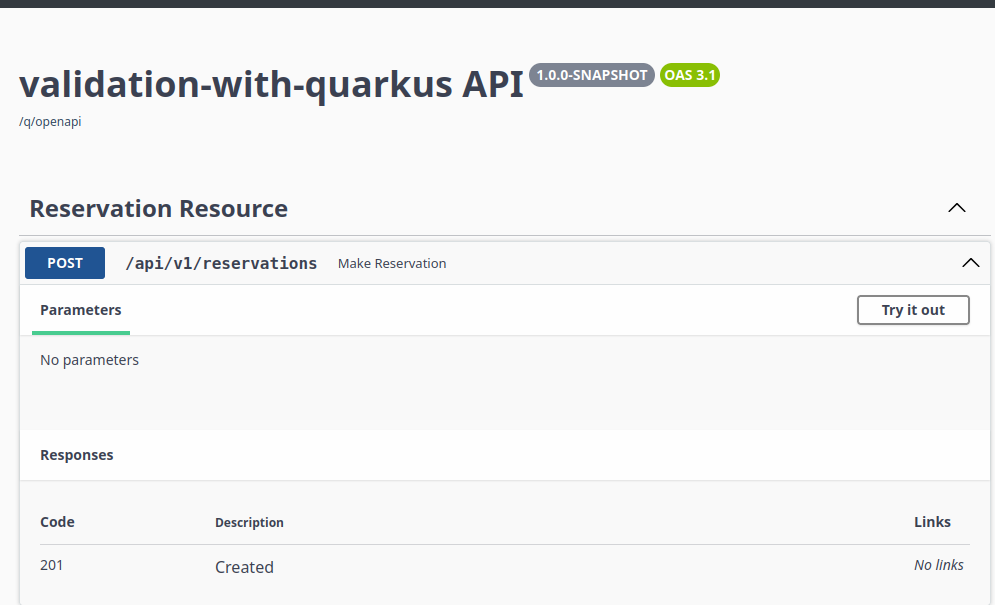
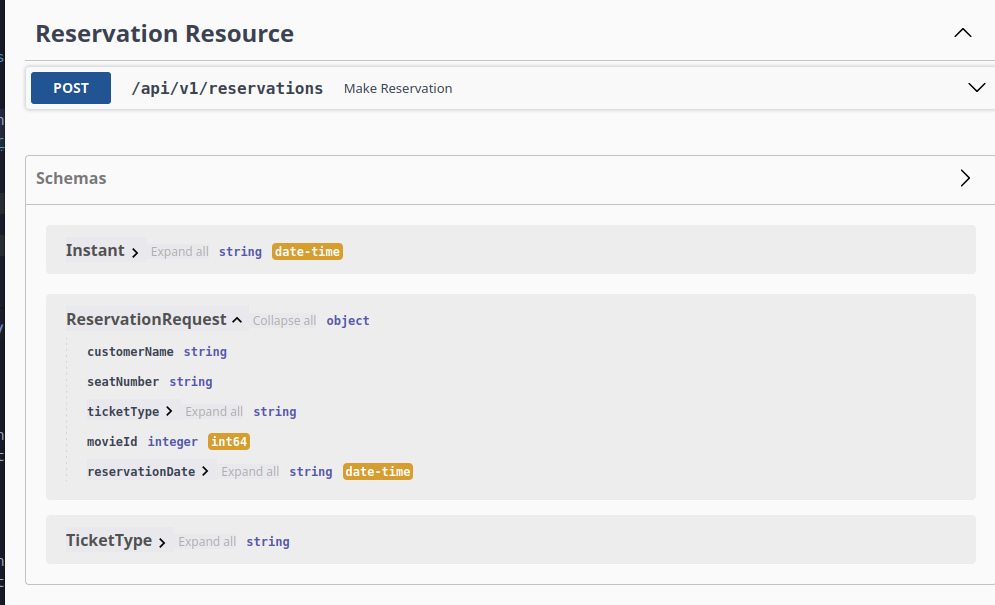
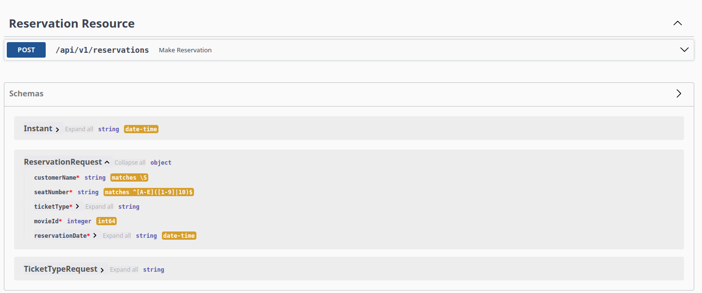

In this short tutorial we will focus on request validation in an Quarkus application. We will develop a small application and explore the three layers of validation:
- Type-validation
- API-validation
- Context-validation

## The domain
The movie theater in our town asked us to develop a small API to make reservations at the local cinema. The only request is that we register a person's name, their seat and which movie they want to attend. In addition, they would like to know what kind of ticket people want to buy. 

Digesting the small "requirement" above we only need the following information in our request

1. The name of the client
2. The seat number
3. Ticket type
4. The movie
5. Date and time of the reservation

## Setting up our project
Like the title already hints at, we are going to use Quarkus as our framework. Quarkus comes with quite a handy initialisation tool which can be installed using [SdkMan](https://sdkman.io/). I assume you start out with a completely empty system, so let's install all our required dependencies:
```bash
sdk install java # Now defaults to Java 25
sdk install maven
sdk install quarkus
```
After installing the required dependencies move to a folder on your system where you are going to store the code for this project and run:
```bash
quarkus create app --name "quarkus-validation"
```

We will use two extensions, the first is for parsing JSON into objects using Jackson and the second is to generate an open-api spec and have a UI to navigate our API:
```bash
quarkus extension add quarkus-smallrye-openapi
quarkus extension add rest-jackson

```

### Setting up our endpoint
We are all set and good to go with the development of our API. If you've followed along so far, you should have a standard Quarkus project with a single endpoint called the `GreetingsResource`. For now, remove the entire package and create a new package called `org.cinema.reservations.api` which will house our new endpoint. Create the endpoint inside as follows:

```java

package org.cinema.reservations.api;

import jakarta.ws.rs.POST;
import jakarta.ws.rs.Path;
import org.cinema.reservations.api.model.ReservationRequest;

@Path("/api/v1/reservations")
public class ReservationResource {
    @POST
    public void makeReservation() {}
}
```
For now this is enough, the `POST` function is kind of useless because it doesn't accept any data, however we can explore our API for the first time now by running `quarkus dev`. This will build and start the project. In your browser navigate to [http://localhost:8080/q/swagger-ui](http://localhost:8080/q/swagger-ui), and you should see something like this:



You are now set-up for the rest of the tutorial!

## Validation
Like I said in the beginning of this post we will divide our validation effort into three layers. I will start with the type-validation, then the api-validation and end with the context-validation. 

### Type-validation
Type-validation is all about designing our endpoint in such a way that the types already do part of the "validation". In our case, we've decided to consume 4 fields, I've added the potential types behind it

| Description | Field name | Field Type|
| ------------| -----------|-----------|
| The name of the client | `customerName` | `String` |
| The seat number | `seatNumber` | `String` |
| The type of ticket | `ticketType` | `enum TicketType` |
| The movie | `movieId` | `Long` |
| The reservation date | `reservationDate` | `Instant` |

There are some assumptions I must explain before we go into developing a request. 
- The `seatNumber` is actually a seat and a row, we could split this into a row and seat, but for now we keep it as a `String`. 
- The movie is actually only the `id` of the movie, we expect that somewhere inside our application we already keep track of the movies. 
- The most interesting field here is the `TicketType`, which we modeled as an `enum`, which in itself is part of the validation, because now we can specify which ticket types are actually valid and which are not. 
- Lastly the `reservationDate` is also modeled as an `Instant`, which only accepts valid date strings of the format: `2025-01-01T12:00:00Z`. Great, let's model our request. Create two new files in the package `org.cinema.reservation.api.models`:
```java
public enum TicketType{
  TOP,
  NORMAL,
  BACK
}
```
and 
```java
public record ReservationRequest(
  String customerName, 
  String seatNumber, 
  TicketType ticketType, 
  Long moviedId, 
  Instant reservationDate)
```
We can now adjust our `ReservationResource` like so: 
```java
@Path("/api/v1/reservations")
public class ReservationResource {
    @POST
    public void makeReservation(ReservationRequest reservationRequest) {
    }
}
```
If we now rerun `quarkus dev` and navigate to [http://localhost:8080/q/swagger-ui](http://localhost:8080/q/swagger-ui) we see the updates to our endpoint:


In the bottom the UI shows the objects we've defined so far, and you can also see the constraints put on our API object. It is not enough, but is already relatively painless to add these constraints. 

Before we continue to the next step of validation we would like to do some testing on our endpoint, we can do this through the swagger-ui, but I don't know about you, but I want to rather automate this. Luckily in Quarkus this is quite simple. In your test folder create a package with the name `org.cinema.reservation.api` and inside create a  new test that is called `ReservationResourceTest`. Annotate your test with `@QuarkusTest` and fill it with the following information:

```java

package org.cinema.reservations.api;

import io.quarkus.test.junit.QuarkusTest;
import io.restassured.http.ContentType;
import org.cinema.reservations.api.model.ReservationRequest;
import org.cinema.reservations.api.model.TicketType;
import org.junit.jupiter.api.Test;

import java.time.Instant;

import static io.restassured.RestAssured.given;

@QuarkusTest
class ReservationResourceTest {


    @Test
    void valid_requests_result_in_a_204() {
        var request = new ReservationRequest("Donald Duck", "D3",
                TicketType.TOP, 1L, Instant.parse("2025-01-01T12:00:00Z"));
        given()
                .body(request)
                .contentType(ContentType.JSON)
                .when()
                .post("/api/v1/reservations")
                .then()
                .statusCode(204);
    }
}
```
This test spins up our application and does a normal REST request to our API. We could improve this, but for the sake of this tutorial this is fine. In addition, let's make a test that should test the not so happy path:
```java
    @Test
    void invalid_request_results_in_a_400() {
        var request = new ReservationRequest(
                null, null, null, null, null);
        given()
                .body(request)
                .contentType(ContentType.JSON)
                .when()
                .post("/api/v1/reservations")
                .then()
                .statusCode(400);
    }

```
We expect in this case that the endpoint will reject our call, because we didn't include any information, however, this will still return the `204` result, because we did not yet specify that our fields should be filled. Let's continue to the next section to fix this.

### API-object validation
For our API object validation we are going to use the Hibernate validator package from [Quarkus](https://quarkus.io), which we can install through a Quarkus extension:
```bash
quarkus extension add hibernate-validator
```
We can add the following to our request object:
```java
package org.cinema.reservations.api.model;

import jakarta.validation.constraints.NotBlank;
import jakarta.validation.constraints.NotNull;
import java.time.Instant;

public record ReservationRequest(
        @NotNull @NotBlank String customerName,
        @NotNull @NotBlank String seatNumber,
        @NotNull TicketType ticketType,
        @NotNull Long movieId,
        @NotNull Instant reservationDate) {
}
```
Be aware in this case that you also take the `@NotNull` from the `jakarta.validation` package. We need to tell the resource to use the validation on our object, we can do this by simply add yet another annotation:
```java
package org.cinema.reservations.api;

import jakarta.validation.Valid;
import jakarta.ws.rs.POST;
import jakarta.ws.rs.Path;
import org.cinema.reservations.api.model.ReservationRequest;

@Path("/api/v1/reservations")
public class ReservationResource {
    @POST
    public void makeReservation(@Valid ReservationRequest reservationRequest) {}
}
```
After this our test will succeed! Great, however, we still have some work to do. The first thing is that it would be great if we can test our validation more fine-grained, so through a unit test. I like to use `assertJ` for my unit tests, it is not required, but if you want to follow along add this to your dependencies in your `pom.xml`:
```xml
<dependency>
    <groupId>org.assertj</groupId>
    <artifactId>assertj-core</artifactId>
    <version>3.26.0</version>
    <scope>test</scope>
</dependency>
```
Create a new file in your test folder in the same package as our resource test and give it the name `ReservationResourceValidationTest`:
```java

class ReservationResourceValidationTest {
  private final Validator validator = Validation.buildDefaultValidatorFactory().getValidator();

  private static List<Arguments> provideInvalidReservations() {
    return List.of(Arguments.of(new ReservationRequest(null, null, null, null, null)));
  }

  @Test
  void valid_case() {
    var reservationRequest =
        new ReservationRequest(
            "Donald Duck", "A1", TicketType.TOP, 1L, Instant.parse("2025-01-01T12:00:00Z"));
    var result = validator.validate(reservationRequest);
    assertThat(result).isEmpty();
  }

  @ParameterizedTest
  @MethodSource("provideInvalidReservations")
  void invalid_cases(ReservationRequest reservationRequest) {
    assertThat(validator.validate(reservationRequest)).isNotEmpty();
  }
}

```
I've added a `@ParameterizedTest` so that we can add more cases our validator can catch in the `provideInvalidReservations`. If you run this all should be well. From now on, every time we add a new invalid case I will just state the invalid case and we will add it to the list first.

The first one concerns the seat "number", it is actually a combination of the row and the number. We have a simple theater, with only 5 rows of seats, labeled A -> E and 10 seats per row labeled 1-10. The first custom validator we will write is that the seat number must be of the format `<letter><number>`. So we will add the following case to our test:
```java
Arguments.of(
            new ReservationRequest(
                "Donal Duck", "1D", TicketType.TOP, 1L, Instant.parse("2025-01-01T12:00:00Z"))
```
All fields are valid, however the `seatNumber` is flipped. For this we can use regex to validate the field. The regex that this should match is: `^[A-E]([1-9]|10)$`, we can add this to our request object like so:
```java
public record ReservationRequest(
    @NotNull @NotBlank String customerName,
    @NotNull @NotBlank @Pattern(regexp = "^[A-E]([1-9]|10)$") String seatNumber,
    @NotNull TicketType ticketType,
    @NotNull Long movieId,
    @NotNull Instant reservationDate) {}
```
After adding the `@Pattern` your tests should be green again.


#### Custom validators
We've come a long way with the standard methods and type-validation, but we can no longer escape it, we need to write some custom validation logic. The thing is, the `TOP` `ticketType` is the only ticket type that can reserve the seats on the row `C`, which makes sense, it gives the best view of the movie. The `BACK` tickets can only sit on the last row, so `E`. Let's add the two test cases that will fail:
```java
Arguments.of(
    new ReservationRequest(
        "Donal Duck", "A1", TicketType.BACK, 1L, Instant.parse("2025-01-01T12:00:00Z"))),
Arguments.of(
    new ReservationRequest(
        "Donal Duck", "C1", TicketType.NORMAL, 1L, Instant.parse("2025-01-01T12:00:00Z")))
```
First create an annotation in the package `org.cinema.reservation.api.validation` and add the following:
```java
@Target({ElementType.TYPE})
@Retention(RetentionPolicy.RUNTIME)
@Constraint(validatedBy = CheckSeatIsAllowedConstraint.class)
public @interface CheckSeatIsAllowed {
  String message() default "Check seat is allowed";
  Class<?>[] groups() default {};
  Class<? extends Payload>[] payload() default {};
}
```
Next in the same package create the constraint itself `CheckSeatIsAllowed`:
```java
public class CheckSeatIsAllowedConstraint
    implements ConstraintValidator<CheckSeatIsAllowed, ReservationRequest> {
  @Override
  public boolean isValid(
      ReservationRequest reservationRequest,
      ConstraintValidatorContext constraintValidatorContext) {

    if (reservationRequest.seatNumber() == null) {
      return false;
    }

    return switch (reservationRequest.ticketType()) {
      case TOP -> true;
      case BACK -> reservationRequest.seatNumber().contains("E");
      case NORMAL -> !reservationRequest.seatNumber().contains("C");
    };
  }
}
```
Now we can use the annotation we've just created on the `ReservationRequest` itself:
```java
@CheckSeatIsAllowed // <-- Add this annotation
public record ReservationRequest(
    @NotNull @NotBlank String customerName,
    @NotNull @NotBlank @Pattern(regexp = "^[A-E]([1-9]|10)$") String seatNumber,
    @NotNull TicketType ticketType,
    @NotNull Long movieId,
    @NotNull Instant reservationDate) {}
```
Now when you run your test you will see that all test cases will succeed.

### Context validation
The last part of our journey is something I would like to call context validation. The reason for this is that you need your application context to validate the data in your API object. For instance, in our case we can validate if the seat is actually available, and if the movie is actually running at that time. I will not go over all the validation, otherwise we are actually building a reservation system for a cinema. However, let's take a very simple implementation to check if the movie is actually playing at the given time. We will for the sake of simplicity only allow the movie "About Time" with the ID `1L`. We ignore the time and all other complexities, because the point remains the same. We will create a validator which injects the repository through the constructor:
```java
@ApplicationScoped
public class MovieScreeningRepository {
  private static final Map<Long, MovieScreening> movieScreenings =
      Map.ofEntries(
          Map.entry(
              1L, new MovieScreening(1L, "About time", Instant.parse("2013-10-13T12:00:00Z"))));

  public Optional<MovieScreening> findMovieScreeningById(long movieId) {
    return Optional.ofNullable(movieScreenings.get(movieId));
  }
}
```
We call this validator from the service-layer of our application:
```java
@ApplicationScoped
public class ReservationService {

  private final MovieScreeningValidator movieScreeningValidator;

  public ReservationService(MovieScreeningValidator movieScreeningValidator) {
    this.movieScreeningValidator = movieScreeningValidator;
  }

  public void makeReservation(Reservation reservation) {
    movieScreeningValidator.validate(reservation);
  }
}
```
Finally, let's add this call to our `ReservationResource`:
```java
@Path("/api/v1/reservations")
public class ReservationResource {
  private final ReservationService reservationService;

  public ReservationResource(ReservationService reservationService) {
    this.reservationService = reservationService;
  }

  @POST
  public void makeReservation(@Valid ReservationRequest reservationRequest) {
    reservationService.makeReservation(
        new Reservation(
            reservationRequest.customerName(),
            reservationRequest.seatNumber(),
            mapTicketType(reservationRequest.ticketType()),
            reservationRequest.movieId(),
            reservationRequest.reservationDate()));
  }

  private TicketType mapTicketType(TicketTypeRequest ticketTypeRequest) {
    return switch (ticketTypeRequest) {
      case TOP -> TicketType.TOP;
      case BACK -> TicketType.BACK;
      case NORMAL -> TicketType.NORMAL;
    };
  }
}
```
If we now add this test-case in our `ReservationResourceTest`, we can see the validation in action:
```java
@Test
void movie_not_screening_results_in_500() {
  var request =
      new ReservationRequest(
          "Donald Duck", "D3", TicketTypeRequest.TOP, 2L, Instant.parse("2025-01-01T12:00:00Z"));
  given()
      .body(request)
      .contentType(ContentType.JSON)
      .when()
      .post("/api/v1/reservations")
      .then()
      .statusCode(500);
}
```
I don't really enjoy the `500` status code, which corresponds to "Internal Server Error", so let's fix that before ending this post. Create a `ValidationExceptionMapper` in your `org.cinimea.reservation.api` folder with the following content:
```java
@Provider
public class ValidationExceptionMapper implements ExceptionMapper<ValidationException> {
  @Override
  public Response toResponse(ValidationException e) {
    return Response.status(400).build();
  }
}
```
Now, even though exception flow is not really nice, we still get the status code corresponding to a bad request. In the end our [Swagger-UI](http://localhost:8080/q/swagger-ui) looks something like this:



## Conclusion
After reading this post you should be aware of the three levels of validation and how to implement them in a Quarkus application. In general the easiest to implement is the "type-validation", after that you can "defend" your API using "api-validation" and finally, if you really must, you can use "context-validation". I hope you enjoyed this post, feel free to share!

You can find the full source code of this example over on [Github](https://github.com/woutervanveen/quarkus-validation).
