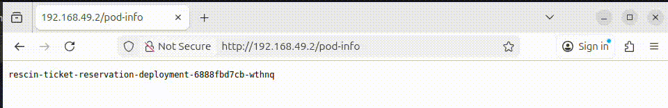


In the [previous post](posts/00_quarkus_validation) we've created a small reservation system for a local cinema. Our application has little functionality, but we've decided that, from the start, we should be able to know how to ship our product. Therefor in this post we will prepare our application for deployment.

So why would you, at this stage, care about deployments at all? I think that deploying often and in an early stage of your project helps to create a serious production ready system. It puts you in the mindset of working with a live system. In addition, if you are making a cloud-native application running on multiple pods gives you a lot of freedom, but also some constraints to take into account. 


## The domain
Since the last time we worked on our application a lot has happened. The director of the local cinema talked to other cinema's during a cinema conference and proudly talked about our application that is under development! We've gained a lot of additional attraction and at least two dozen other cinema's want to share their resources and want to use our application. We need to think about a deployment strategy that gives us the flexibility to deploy multiple times a day without causing any downtime. Also the load to our application has become unpredictable and we need to start thinking about scaling. Let me summarize "the requirements" as follows:
1.  Deployment should be done without down-time
2.  Our application should be able to dynamically scale depending on the load.

Because of all the popularity we've decided to name our application, and we've chosen for the name: `Rescin`. You will see this name throughout this tutorial.


### The solution
[Kubernetes](https://kubernetes.io) is an excellent fit for our application, and it is widely used within the industry. Kubernetes is a deployment orchestration tool which uses some form of containerized application. We are able to use a rolling release, upgrading our application one pod at a time. This means no down-time, great! 

## Setting up your environment
For this post we will limit ourselves to get our application running in three pods next to each other in a local [Minikube](https://minikube.sigs.k8s.io/) cluster. Never use a Minikube cluster as a true production cluster, it is only meant for testing and development! To follow along with this tutorial you can use this [branch](https://github.com/woutervanveen/quarkus-validation/tree/deploying-quarkus-to-minikube) as a start for this tutorial. In addition, you will need the following tools:

- [Docker](https://www.docker.com/)
- [kubectl](https://kubernetes.io/docs/reference/kubectl/)
- [Minikube](https://minikube.sigs.k8s.io/docs/start/?arch=%2Flinux%2Fx86-64%2Fstable%2Fbinary+download)

I will be using [Intelij Idea](https://www.jetbrains.com/idea/) as my text editor, but you can use any text-editor like [NeoVim](https://neovim.io/) and [VSCode](https://code.visualstudio.com/)

## Packaging in a Docker container
Before we can hand off our application to Kubernetes we need to package it in a docker container. Luckily for us a [Quarkus](https://quarkus.io) project ships with a `Dockerfile`:
```docker
FROM registry.access.redhat.com/ubi9/openjdk-21:1.23

ENV LANGUAGE='en_US:en'


# We make four distinct layers so if there are application changes the library layers can be re-used
COPY --chown=185 target/quarkus-app/lib/ /deployments/lib/
COPY --chown=185 target/quarkus-app/*.jar /deployments/
COPY --chown=185 target/quarkus-app/app/ /deployments/app/
COPY --chown=185 target/quarkus-app/quarkus/ /deployments/quarkus/

EXPOSE 8080
USER 185
ENV JAVA_OPTS_APPEND="-Dquarkus.http.host=0.0.0.0 -Djava.util.logging.manager=org.jboss.logmanager.LogManager"
ENV JAVA_APP_JAR="/deployments/quarkus-run.jar"

ENTRYPOINT [ "/opt/jboss/container/java/run/run-java.sh" ]
```
In essence this file builds a container based on a container from redhat (`FROM registry.access.redhat.com/ubi9/openjdk-21:1.23`). After that it copies over the files from our project from the `target` folder to the `/deployments` folder inside the container. It exposes port `8080` and finally it sets an entry point for the container to bootstrap our application. We can build a container image in two steps; first build the java applciation into a `.jar` file by running this command in the root of your project:
```bash
mvn package
```
Second, from the root of your project run the following command:
```bash
docker build -t rescin/ticket-reservation:v0.0.1 -f src/main/docker/Dockerfile.jvm .
```
You can now check if you image was successfully created by running `docker image ls` and you should see something like this:
```
IMAGE                                                                                                 ID             DISK USAGE   CONTENT SIZE   EXTRA
rescin/ticket-reservation:v0.0.1                                                                      08bec9c580a8        641MB          179MB
```
If you are like me you want to test the above image, which we can easily do by starting a container with this image:
```bash
docker run -d -p 8080:8080 rescin/ticket-reservation:v0.0.1 
```
You should see something similar to this:
```

CONTAINER ID   IMAGE                                 COMMAND                  CREATED          STATUS             PORTS                                                                                                                                  NAMES
f4a3eedfb245   rescin/ticket-reservation:v0.0.1      "/opt/jboss/containe…"   53 seconds ago   Up 53 seconds      0.0.0.0:8080->8080/tcp, [::]:8080->8080/tcp, 8443/tcp                                                                                  peaceful_khayyam
```
Stop the container with `docker stop peaceful_khayyam` (note that the name is random, so check how the container is named in your case). 

## Deploying to a Minikube cluster
We now have our container image and are ready to start deploying! Like I said before we are going to use Minikube to create a Kubernetes cluster. If you've installed Minikube you can run:
```bash
minikube start
```
to create your cluster with a single node. You can think of a `node` as a server that is running Kubernetes. In production a Kubernetes cluster consists of multiple nodes, but for testing a single node is good enough. We can navigate the cluster using the command `kubectl`. For instance checking out how many nodes we have using `kubectl get nodes`:
```
NAME       STATUS   ROLES           AGE   VERSION
minikube   Ready    control-plane   13d   v1.34.0
```
A single instance of an application is called a `pod` and is akin to the container we've just created before. You can see all the pods in the default namespace by running `kubectl get pods`, you should have no pods. Now, if you run the same command with the `-A` flag you should see all the pods of the Kubernetes cluster itself. 

### deployment.yaml
The first step is to create a deployment which in Kubernetes can be defined in a simple `yaml` file. A deployment defines what application to run, and how many instances of that application. For us the deployment is the first step of getting our applciation running in Kubernetes. The basis of any `yaml` file for Kubernetes looks like this:
```yaml
apiVersion:
kind:
metadata:
spec:
```
We are going to create a file with the `kind` `Deployment` which is part of the `apiVersion: apps/v1`. Now we are going to give our deployment a name: 

```yaml
apiVersion: apps/v1
kind: Deployment
metadata:
  name: rescin-ticket-reservation-deployment
spec:
```
The last part is the `spec` section. In a deployment this setion has a `template`, which holds a `metadata` and a yet another spec. In this nested `spec` we can finally define our containers. The total version looks like this:

```yaml
apiVersion: apps/v1
kind: Deployment
metadata:
  name: rescin-ticket-reservation-deployment
spec:
  template:
    metadata:
      name: rescin-ticket-reservation
      labels:
        app: rescin-ticket-reservation
    spec:
      containers:
        - name: rescin-ticket-reservation
          image: rescin/ticket-reservation:v0.0.2
          imagePullPolicy: IfNotPresent
          ports:
            - containerPort: 8080
```
There are two parts that we are going to add, the first one is the selector which actually adds our container to our deployment. For this Kubernetes uses labels. In our case we've defined the label with key `app` and value `rescin-ticket-reservation`. The last part I want to add the amount of `replicas`, or instances of our application. For now let's select 3 replica's. The total `deployment.yaml` should looke like this:
```yaml
apiVersion: apps/v1
kind: Deployment
metadata:
  name: rescin-ticket-reservation-deployment
spec:
  template:
    metadata:
      name: rescin-ticket-reservation
      labels:
        app: rescin-ticket-reservation
    spec:
      containers:
        - name: rescin-ticket-reservation
          image: rescin/ticket-reservation:v0.0.2
          imagePullPolicy: IfNotPresent
          ports:
            - containerPort: 8080
  replicas: 3
  selector:
     matchLabels:
       app: rescin-ticket-reservation

```
To use this definition we are going to apply it using `kubectl`:
```bash
kubectl apply -f deployment.yaml
```
If you run `kubectl get pods` you can see your pods, but they are not in the best state in the world. No pod is ready and they all have the error `ImagePullBackOff`, or in other words Kubernetes cannot find the image we want to run in our deployment.
```

NAME                                                   READY   STATUS             RESTARTS   AGE
rescin-ticket-reservation-deployment-b68598fd4-7j97j   0/1     ImagePullBackOff   0          48s
rescin-ticket-reservation-deployment-b68598fd4-dx5xc   0/1     ImagePullBackOff   0          48s
rescin-ticket-reservation-deployment-b68598fd4-hcz26   0/1     ImagePullBackOff   0          48s
```
Minikube cannot find our container because it is only available to the docker running on our host system. Minikube actually runs another docker inside it's container, and we need to expose our image to that docker. Luckily it is quite easy to do this:
```bash
eval $(minikube docker-env)
docker build -t rescin/ticket-reservation:v0.0.1 -f src/main/docker/Dockerfile.jvm
```
Now we should see our pods running:
```
NAME                                                   READY   STATUS    RESTARTS   AGE
rescin-ticket-reservation-deployment-b68598fd4-7j97j   1/1     Running   0          7m53s
rescin-ticket-reservation-deployment-b68598fd4-dx5xc   1/1     Running   0          7m53s
rescin-ticket-reservation-deployment-b68598fd4-hcz26   1/1     Running   0          7m53s
```

### service.yaml
Running pods in a cluster is nice, but we need to access our application from outside the cluster. The first step in doing this is defining a `service.yaml`, which according to the [documentation](https://kubernetes.io/docs/concepts/services-networking/service/) does the following:

> The Service API, part of Kubernetes, is an abstraction to help you expose groups of Pods over a network.

The total `service.yaml`:

```yaml
apiVersion: v1
kind: Service
metadata:
  name: rescin-ticket-reservation-service
spec:
  selector:
    app: rescin-ticket-reservation
  ports:
    - port: 8080
```
We are again using the selector based on our label: `app: rescin-ticket-reservation`. Apply this change by running the command `kubectl apply -f service.yaml`. You can check all the services in your cluster with the command `kubectl get services`, you should see something like this:

```
NAME                                TYPE        CLUSTER-IP       EXTERNAL-IP   PORT(S)    AGE
kubernetes                          ClusterIP   10.96.0.1        <none>        443/TCP    14d
rescin-ticket-reservation-service   ClusterIP   10.106.156.201   <none>        8080/TCP   25h
```
You can see that our service has an internal cluster-ip assigned which can be used to access our service inside the cluster.

### ingress.yaml
Ingress means that we are going to allow traffic from outside to get into our cluster. We want users to access our application through a web-address, and Kubernetes decide to which pod the traffic is routed. A load balancer is often provided by the cloud on which your application is hosted, but for our Minikube cluster we don't have such a luxury. Therefore we need to install an add-on:

```bash
minikube addons enable ingress
```
The next step is to define a `ingress.yaml` which routes the traffic from some endpoint to the `service` we've defined before:
```yaml
apiVersion: networking.k8s.io/v1
kind: Ingress
metadata:
  name: rescin-ticket-reservation-ingress
spec:
  rules:
    - http:
        paths:
          - pathType: Prefix
            path: /
            backend:
              service:
                name: rescin-ticket-reservation-service
                port:
                  number: 8080
```
Like before apply this change using `kubectl apply -f ingress.yaml`. When running `kubectl get ingress` you should see the freshly created ingress controller. However, it can be that you don't have an external ip-address assigned, in that case you need to wait a couple of minutes. After a while you should get an output similar to this:
```
NAME                                CLASS   HOSTS   ADDRESS        PORTS   AGE
rescin-ticket-reservation-ingress   nginx   *       192.168.49.2   80      25h
```
Now you can access your application through `192.168.49.2/<some-endpoint>`. Well, what should we do for `some-endpoint`? 

### Testing our service
We now have a full service running inside our Kubernetes cluster, but in order to test it we need an endpoint. I always like to use a `GET` endpoint for this because of the instant verification if it works. In this case I would also like to show that the requests are balanced between the pods. Let's create an endpoint that outputs the name of the pod that is handeling the request. Create a file called `PodInformationResource.java` with the following information:
```java
@Path("/pod-info")
public class PodInformationResource {

  @ConfigProperty(name = "POD_NAME", defaultValue = "unknown")
  String podName;

  @GET
  @Produces(MediaType.TEXT_PLAIN)
  public String getPodInfo() {
    return podName;
  }
}
```
What this does is expose the environment variable `POD_NAME` over a get-endpoint. When you run this service with the `quarkus dev` command you will get an `unkown`. Make sure that you've ran `eval $(minikube docker-env)` before building your image. Now let's build this image with `docker build -f src/main/docker/Dockerfile.jvm -t rescin/ticket-reservation:v0.0.2 .` (note that we've changed the version to `0.0.2`). To get the environment variable inside our pod we need to alter our deployment:
```yaml

apiVersion: apps/v1
kind: Deployment
metadata:
  name: rescin-ticket-reservation-deployment
spec:
  template:
    metadata:
      name: rescin-ticket-reservation
      labels:
        app: rescin-ticket-reservation
    spec:
      containers:
        - name: rescin-ticket-reservation
          image: rescin/ticket-reservation:v0.0.2
          imagePullPolicy: IfNotPresent
          ports:
            - containerPort: 8080
          env:
            - name: POD_NAME
              valueFrom:
                fieldRef:
                  fieldPath: metadata.name
  replicas: 3
  selector:
     matchLabels:
       app: rescin-ticket-reservation

```
After changing your deployment just apply it again. Kubernetes will perform a rolling release. Now retrieve the ip address of Minikube with `minikube ip` and use that in your browser to go to `http://<minikube ip>/pod-info`. You should see the name of one of the pods in your cluster (`kubectl get pods`). If you refresh your page you should see a different podname:



Nice, this seems to work well! We can also automate this test by running a small Python script that calls our endpoint a number of times:
```Python
import requests


def main() -> None:
    url = "http://192.168.49.2/pod-info"
    data = {}
    for i in range(1, 100):
        response = requests.get(url).content.decode("utf-8")

        if response not in data.keys():
            data[response] = 1
        else:
            data[response] += 1

    for key in data.keys():
        print(f"pod {key} handled {data[key]} requests")


if __name__ == "__main__":
    main()

```
This will output something like this:
```
pod rescin-ticket-reservation-deployment-6888fbd7cb-dvh8v handled 34 requests
pod rescin-ticket-reservation-deployment-6888fbd7cb-wthnq handled 34 requests
pod rescin-ticket-reservation-deployment-6888fbd7cb-cl8r5 handled 31 requests
```


## Conclusion
In this post we took our Quarkus application and deployed it in a Kubernetes cluster running locally on our machine. We did this early on in the project such that we get in a mindset of building cloud-native applications. We now also have a way of deploying our application to a production environment.

If you want to follow allong with these tutorials you can find the project on [Github](https://github.com/woutervanveen/quarkus-validation/tree/deploying-quarkus-to-minikube). 


