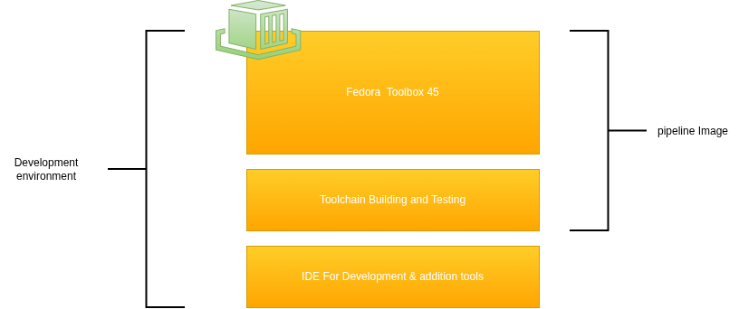

Setting up a development environment the DevOps way! What I mean is a reproducible and declarative environment that "just works". In this post I will go over the steps to setup a development environment using Fedora Toolbox.

But why stop there? Let's use our development environment in our pipelines to actually build the images for our production environments. Let's bridge the gap between "it works on my machine" and running and testing enterprise software in a reliable way.

## The concept

The idea of a development environment is to create a specialized environment that is isolated from your workstation. I am going to do this using containers running on [Podman](https://podman.io/), which is "the docker version" of Red Hat. Inside a development environment you should have all the tools required for developing the product you are working on. For instance, when you are developing Java you should have a Jdk installed with the correct Java version, but also an editor to actually write the code in.

However, I want to take this a step further, I want to use the same setup to run our automatic tests in pipelines and actually build this image. That's why we are going to build two images and stack the one on the other.



## Prerequisites

I am going to use a workstation that has [Fedora Silverblue](https://fedoraproject.org/atomic-desktops/silverblue/) on it. This is an immutable operating system, with native support for Toolbox. If you want to follow along the easiest approach is to just install Fedora Silverblue, either on your computer or in a VM to test the waters.

For the last part of the tutorial I am using a self-hosted [Gitea](https://about.gitea.com/) instance that runs on my home-lab. If you want to follow along you can simply install it on your own hardware using the following guide: [Installing Gitea with Docker](https://docs.gitea.com/installation/install-with-docker).

## Using Toolbox

I like to work with practical examples, so for explaining how I setup Toolbox I will use an existing project I am working on. At the moment I am building Kafka from scratch (I am using [Codecrafters](https://app.codecrafters.io/r/lovely-gorilla-458787)). I am trying to do this using Java, so therefore I've create a Toolbox to build my project. For this Toolbox I need the following stuff installed:

- zsh
- Podman
- Java JDK 25
- Maven
- Editors:
  - Neovim
  - VSCode
  - Intelij

### The imperative way

Creating a toolbox is a straight forward process, just type:

```bash
toolbox create kafka-dev-env
```

This will create an environment using the latest Fedora image. You can now use your image like this:

```bash
toolbox enter kafka-dev-env
```

We can now simply install all the required packages as you would on any mutable operating system:

```bash
sudo dnf install -y neovim zsh java-25-openjdk.x86_64 maven podman
```

Next up are the two graphical editors:

```bash
# Visual Studio Code
sudo rpm --import https://packages.microsoft.com/keys/microsoft.asc
echo -e "[code]\nname=Visual Studio Code\nbaseurl=https://packages.microsoft.com/yumrepos/vscode\nenabled=1\ngpgcheck=1\ngpgkey=https://packages.microsoft.com/keys/microsoft.asc" | sudo tee /etc/yum.repos.d/vscode.repo > /dev/null
dnf check-update
sudo dnf install -y code

# Intelij
curl -L "https://download.jetbrains.com/product?code=IIC&latest&distribution=linux" -o idea-community.tar.gz
sudo tar -xzf idea-*.tar.gz -C /opt/
rm idea-community.tar.gz
sudo ln -s /opt/idea-*/bin/idea.sh /usr/bin/idea
```

Finally, to get Podman working from inside the toolbox run the following command:

``` bash
export CONTAINER_HOST=unix:///run/user/1000/podman/podman.sock
```

Nice, you should have a fully functioning development environment! You can start VSCode by typing `code .` and if you rather want to run Intelij: `idea` should do the trick. If you stop here you already have a great environment and you can use it happily. If you want to exit your Toolbox just type `exit` and you are back to your normal workstation.

### Next level; The DevOps way

Let's take this a bit further, because writing things in a declarative way is nice when you are experimenting, but when you want reliable and reusable environments we need something better. Because Toolbox is "just" running a ContainerD environment underneath (Podman), we can write a `Containerfile` and build that file into an image. Let's take all the command we used to get our environment running and add it into a file called `Containerfile`:

```Dockerfile
FROM registry.fedoraproject.org/fedora-toolbox:45

RUN sudo dnf install -y neovim zsh java-25-openjdk.x86_64 maven podman

# Install VSCode
RUN sudo rpm --import https://packages.microsoft.com/keys/microsoft.asc
RUN echo -e "[code]\nname=Visual Studio Code\nbaseurl=https://packages.microsoft.com/yumrepos/vscode\nenabled=1\ngpgcheck=1\ngpgkey=https://packages.microsoft.com/keys/microsoft.asc" | sudo tee /etc/yum.repos.d/vscode.repo > /dev/null
RUN dnf check-update
RUN sudo dnf install -y code

# Intall Intelij
RUN curl -L "https://download.jetbrains.com/product?code=IIC&latest&distribution=linux" -o idea-community.tar.gz
RUN sudo tar -xzf idea-*.tar.gz -C /opt/
RUN rm idea-community.tar.gz
RUN sudo ln -s /opt/idea-*/bin/idea.sh /usr/bin/idea

# Expose podman
ENV CONTAINER_HOST=unix:///run/user/1000/podman/podman.sock
```

Now we can build this using the following command:

```bash
podman build -t kafka-dev-env:v0.0.1 .
```

This creates an image which can be used with Toolbox:

```bash
toolbox create --image kafka-dev-env:v0.0.1 declarative-kafka-dev-env
```

Nice, this is a whole lot better, we now have a file that can be checked into git.

### Pushing your images to a repository

I've created a git repository and pushed it to my local Gitea instance. In addition, I also pushed the image itself to the image repository on Gitea. You need to login with your Podman instance to your Gitea server. To login in follow the following steps:

1. Click on your Profile picture and go to settings
2. Click on applications, and click "generate new token", make sure that it has read and write access to the packages
3. Copy the token that is displayed
4. Back on your workstation type:

```bash
podman login <url_to_your_instance>
```

Use your email address or username and for the password paste the token.

After this administration let's build the image again, but now with the url of your Gitea in the tag of your image:

```bash
podman build -t <url_to_your_instance>/kafka-dev-env:v0.0.1 -t <url_to_your_instance>/kafka-dev/dev:latest .
```

Next push it to your remote repository:

```bash
podman push <url_to_your_instance>/kafka-dev-env:v0.0.1 
podman push <url_to_your_instance>/kafka-dev/dev:latest
```

To use this image you can go to any workstation that can read on your Gitea repository and create a Toolbox:

```bash
toolbox create --image <url_to_your_instance>/kafka-dev-env remote-kafka-dev-env
```

### Build the images using Gitea

Wouldn't it be nice to just push changes to your Gitea repository and have the pipelines build your images automatically? That' is exactly what we are going to do. First create a folder called `.gitea/workflows` and add to files inside:

`build-image.yaml`:

```yaml

on:
  workflow_call:
    inputs:
      image_name:
        required: true
        type: string
      image_tag:
        required: true
        type: string
      container_file:
        required: true
        type: string
    secrets: inherit
jobs:
  build-image:
    runs-on: ubuntu-latest
    steps:
      - name: Checkout code
        uses: actions/checkout@v3
      
      - name: Log in to Gitea registry
        run: |
          docker login <url_to_your_instance> \
          -u  ${{ secrets.REGISTRY_USER }} \
          -p ${{ secrets.REGISTRY_PASSWORD }}

      - name: Build image
        run: |
          docker build -t <url_to_your_instance>/${{ gitea.repository }}/${{ inputs.image_name }}:${{ inputs.image_tag }} -t git.rustendecavia.nl/${{ gitea.repository }}/${{ inputs.image_name }}:latest  -f ${{ inputs.container_file }} .

      - name: Push image
        run: |
          docker push <url_to_your_instance>/${{ gitea.repository }}/${{ inputs.image_name }}:${{ inputs.image_tag }}
          docker push <url_to_your_instance>/${{ gitea.repository }}/${{ inputs.image_name }}:latest
```

`main.yaml`:

```yaml
name: Build and Push Container image

on:
  push:
    branches:
      - main

jobs:
  build-images:
    uses: ./.gitea/workflows/build-image.yaml
    with:
      image_name: java
      image_tag: ${{ gitea.sha }} 
      container_file: ./java/Containerfile
    secrets:
      REGISTRY_USER: ${{ secrets.REGISTRY_USER }}
      REGISTRY_PASSWORD: ${{ secrets.REGISTRY_PASSWORD }}

```

You need to create an application token again and make sure you've added it to the secrets of your project (go to settings --> Actions --> Secrets). I've also added the username there, just because I don't like to hardcode any credentials. Now after setting these secrets you can go an push the two files to the repository. If all goes well you should see a pipeline being started and after a while your images are added to the image registry automatically. Every time you make a change to the container file of your development environment you get a new image.

As an added bonus, I've also installed Renovate on my Gitea instance (checkout this excellent tutorial to get you started: [Use renovate bot to automatically monitor software packages](https://about.gitea.com/resources/tutorials/use-gitea-and-renovate-bot-to-automatically-monitor-software-packages)). This means that the image file is also updated when a new one comes out, keeping you up to date with the latest images!

## Reusing your Toolbox image for your pipelines

Wouldn't it be nice to bridge the gap between the pipeline tests and the tests in your development environment? With the development environment we've been creating in this tutorial we actually can! However, our pipelines don't need editors or other stuff that you might add later to improve your development environment. Therefore the first step is to split the `Containerfile` into two separate files, one for the pipeline and one including all the packages.

### Splitting your image

To split your image create two files:

- `Containerfile.pipeline`
- `Containerfile.dev`

In the pipeline file add the following:

```Dockerfile
FROM registry.fedoraproject.org/fedora-toolbox:45

RUN sudo dnf install -y java-25-openjdk.x86_64 maven
```

```Dockerfile
FROM <url_to_your_instance>/<url_to_your_base_image>:latest

RUN sudo dnf install -y neovim zsh podman

# Install VSCode
RUN sudo rpm --import https://packages.microsoft.com/keys/microsoft.asc
RUN echo -e "[code]\nname=Visual Studio Code\nbaseurl=https://packages.microsoft.com/yumrepos/vscode\nenabled=1\ngpgcheck=1\ngpgkey=https://packages.microsoft.com/keys/microsoft.asc" | sudo tee /etc/yum.repos.d/vscode.repo > /dev/null
RUN dnf check-update
RUN sudo dnf install -y code

# Intall Intelij
RUN curl -L "https://download.jetbrains.com/product?code=IIC&latest&distribution=linux" -o idea-community.tar.gz
RUN sudo tar -xzf idea-*.tar.gz -C /opt/
RUN rm idea-community.tar.gz
RUN sudo ln -s /opt/idea-*/bin/idea.sh /usr/bin/idea

# Expose podman
ENV CONTAINER_HOST=unix:///run/user/1000/podman/podman.sock
```

Adjust the relevant sections of your pipelines:

```yaml

      - name: Build image
        run: |
          docker build -t <url_to_your_instance>/${{ gitea.repository }}/${{ inputs.image_name }}:${{ inputs.image_tag }} -t git.rustendecavia.nl/${{ gitea.repository }}/${{ inputs.image_name }}_pipeline:latest  -f ${{ inputs.container_file }}.pipeline .
          docker build -t <url_to_your_instance>/${{ gitea.repository }}/${{ inputs.image_name }}:${{ inputs.image_tag }} -t git.rustendecavia.nl/${{ gitea.repository }}/${{ inputs.image_name }}:latest  -f ${{ inputs.container_file }}.dev .

      - name: Push image
        run: |
          docker push <url_to_your_instance>/${{ gitea.repository }}/${{ inputs.image_name }}_pipeline:${{ inputs.image_tag }}
          docker push <url_to_your_instance>/${{ gitea.repository }}/${{ inputs.image_name }}_pipeline:latest

          docker push <url_to_your_instance>/${{ gitea.repository }}/${{ inputs.image_name }}:${{ inputs.image_tag }}
          docker push <url_to_your_instance>/${{ gitea.repository }}/${{ inputs.image_name }}:latest
```

### Use your image in the pipelines

 To do this you actually need to alter the settings of your Gitea runner and find the section which is called `labels` and add the following:

```yaml
  labels:
    - "ubuntu-latest:docker://gitea/runner-images:ubuntu-latest"
    - "ubuntu-22.04:docker://gitea/runner-images:ubuntu-22.04"
    - "ubuntu-20.04:docker://gitea/runner-images:ubuntu-20.04"
    - "kafka-dev-env:docker://<url_to_your_instance>/<path_to_your_image>_pipeline:latest"
```

You can now use this image from your project like so:

```yaml
name: Test & build
run-name: "PR #${{ gitea.event.pull_request.number }} - ${{ gitea.event.pull_request.title }}"
on:
  pull_request:
    types: [opened, synchronize]

jobs:
  maven-test:
    runs-on: kafka-dev-env # <-- This determines which image is being used
    steps:
      - name: Checkout code
        uses: actions/checkout@v3
      - name: Run tests
        run: mvn clean verify
```

## Conclusion

In this post I went over the steps to take your local development environment to the next level! I've also went over the steps to automatically build the image and use it in your pipelines. This delivers on a promise to close the gap between "works on my machine" and the testing environment. I hope you enjoyed reading this short tutorial!
